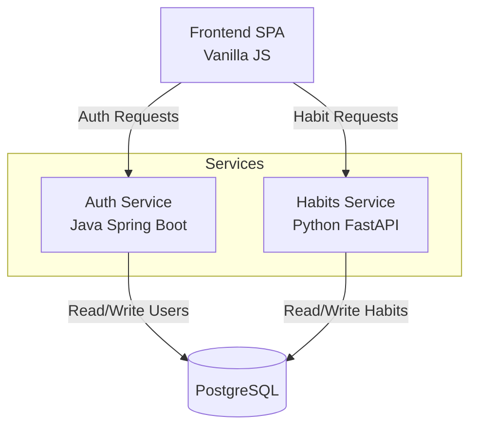

# Habitus - Technical Architecture

This document provides a deep dive into the internal design, components, and data flows of Habitus. It is intended for developers who want to understand how the system works under the hood.

---

## 1. High-Level Architecture

Habitus follows a microservices-inspired architecture, separating authentication concerns from the core domain logic.

### 1.1. Components

#### Frontend (Web App)
- **Tech**: Vanilla JavaScript (ES Modules), HTML5, CSS3.
- **Location**: `/frontend`.
- **Key Modules**:
    - `router.js`: Handles client-side navigation (Login vs. App).
    - `authApi.js`: Communicates with Java backend for login/register.
    - `habitsApi.js`: Communicates with Python backend for habits/checkins.
    - `profileView.js`, `dailyChecklistView.js`: UI rendering logic.
- **State**: Uses `localStorage` for JWT and user details; in-memory state for active view data.

#### Java Auth Service
- **Tech**: Java 17, Spring Boot 3, Spring Security, JPA.
- **Location**: `/backend-java/authservice`.
- **Responsibilities**:
    - **Identity Management**: User registration, login.
    - **Password Management**: Forgot password, change password (via SMTP).
    - **JWT Issuance**: Generates signed tokens containing user claims (`sub`, `iat`, `exp`).

#### Python Habit Service
- **Tech**: Python 3.10+, FastAPI, SQLAlchemy, Pydantic.
- **Location**: `/backend_python`.
- **Responsibilities**:
    - **Habit Management**: CRUD for globally available habits and user-specific subscriptions.
    - **Streak Engine**: Logic to determine if a streak is kept, broken, or frozen.
    - **Gamification**: Achievement unlocks and statistics aggregation.

#### Database
- **Tech**: PostgreSQL 15.
- **Schema**: Shared database schema (monolithic DB pattern for MVP simplicity).
- **Tables**:
    - `users`: Core identity.
    - `habits`: Catalog of system habits.
    - `user_habits`: Habits subscribed to by a user.
    - `habit_tracker`: Daily check-in log.
    - `achievements`: Definitions of achievements.
    - `user_achievements`: Unlocked achievements.

---

## 2. Streak Engine

The streak engine is the core gamification logic, located in `backend_python/logic/streak_engine.py`.

### 2.1. Logic & Transitions

The system calculates streaks dynamically based on the `habit_tracker` table.

- **Streak Window**: The time period in which a user must complete a habit to keep the streak alive.
    - **Production Mode**: The window is the current calendar day (00:00 to 23:59 Local Server Time).
    - **Test Mode**: The window is a sliding window of $N$ seconds (default 60s) from the last completion.

- **Check-in Process**:
    1. User clicks "Done".
    2. Backend creates a record in `habit_tracker`.
    3. Engine checks the *previous* completion:
        - If yesterday (or within valid window), `current_streak += 1`.
        - If today (duplicate), ignore or update timestamp.
        - If > 1 day ago (window missed), `current_streak = 1` (Reset).

- **Streak Freeze** (Future): The schema supports logic to "freeze" a streak if a user has a consumable item, preventing a reset on a missed day.

### 2.2. Data Fields (`user_habits`)
- `current_streak`: Integer. Current active streak.
- `longest_streak`: Integer. All-time high.
- `last_completed_at`: Timestamp. Critical for calculating if the streak is broken.

---

## 3. Achievement System

Achievements are event-driven, triggered mainly during the check-in process. Logic resides in `backend_python/logic/achievement_engine.py`.

### 3.1. Categories
Achievements are grouped into tiers:
- **Bronze**: Early milestones (e.g., "First Step", "3 Day Streak").
- **Silver**: Intermediate goals (e.g., "7 Day Streak", "10 Total Completions").
- **Gold**: Advanced mastery (e.g., "30 Day Streak", "100 Total Completions").

### 3.2. Unlock Flow
1. **Event**: User completes a habit.
2. **Evaluation**: `evaluate_achievements(user_id)` is called.
3. **Check**: The engine iterates through defined rules:
    - *Streak Rules*: Is `current_streak` >= $X$?
    - *Count Rules*: Is `total_completions` >= $Y$?
4. **Grant**: If condition met AND not already in `user_achievements`:
    - Insert into `user_achievements`.
    - Return list of *newly unlocked* achievements to frontend.
5. **UI**: Frontend displays a Toast notification immediately.

---

## 4. Error Handling & Edge Cases

### 4.1. Streak Expiry
- **Frontend**: On page load, the frontend checks if the last completion was yesterday or earlier. If the window has passed, it visually resets the displayed streak to 0 (even if DB isn't updated until next action).
- **Backend**: Creating a new check-in after expiry naturally handles the reset logic (setting streak to 1).

### 4.2. Deletion
- **Delete Habit**: Removes the `user_habit` association. Historical `habit_tracker` data is typically cascaded or soft-deleted (depending on strictness of foreign keys).
- **Delete Account**: Cascades to remove all `user_habits`, `habit_tracker` entries, and `user_achievements`.

### 4.3. Concurrency
- Database constraints prevent double-checkins for the exact same millisecond, but logic handles multiple clicks gracefully by treating them as idempotent operations for the same day.
